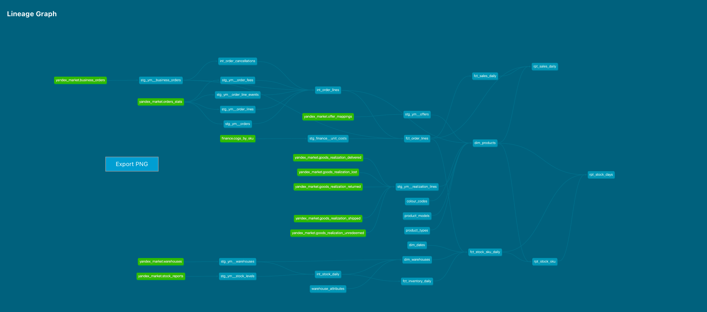

# Marketplace analytics — dbt on Snowflake

<!-- TEMPLATE. Fill in, replace TODOs, add the two screenshots, delete this comment. Keep it to one screen. -->

End-to-end analytics pipeline for a small apparel brand selling through a marketplace: seller-API exports → Snowflake → dbt (staging → marts, tests, docs) → Looker Studio.
Built to answer two owner questions I had myself: **which SKUs actually make money after marketplace fees**, and **how fast inventory turns** — the marketplace's own turnover report is used as a benchmark and reconciled against my numbers.

> Real sales data is private. The repo ships with **synthetic seeds of the same shape**, so `dbt build --vars '{"use_demo_seeds": true}'` runs end-to-end without API access. The public dashboard shows indexed metrics (base month = 100), not absolute figures.

## Architecture

```
seller API (async reports, JSON) ──ingest/──▶ Snowflake RAW (as-is, VARCHAR)
                                              └─▶ dbt staging (typed, deduped, freshness-tested)
                                                   └─▶ intermediate (fee allocation per order line)
                                                        └─▶ marts: fct_order_items (incremental/merge), fct_sales_daily,
                                                            fct_inventory_turnover_monthly, dim_products
                                                             └─▶ reporting views (indexed) ──▶ Looker Studio
```



## What is worth looking at

- **Incremental model with a 14-day lookback** (`fct_order_items`): order statuses change retroactively (returns, cancellations), so the merge window is wider than "since last run". <!-- TODO: link -->
- **Fee allocation** (`int_order_items_enriched`): marketplace fees arrive per order; they are allocated to order lines proportionally to line value, and a singular test asserts the allocation neither loses nor creates money.
- **Reconciliation test** (`tests/assert_turnover_matches_marketplace.sql`): my turnover vs the marketplace's report, ±10 % per SKU. Systematic differences and why: <!-- TODO: 2–3 bullets after you see the numbers -->
- **Source freshness** on every raw table; **source-or-seed switch** (`macros/source_or_seed.sql`) so CI runs on synthetic data.
- **Raw layer fully documented, from one place** (`scripts/gen_sources_yml.py`): all ~400 raw columns across 12 tables are described in the dbt sources yaml (descriptions from the seller-API spec and report docs); the column lists are derived from the downloaded files, so a new report column cannot go undocumented silently, and `load_to_snowflake.py` pushes the same descriptions into Snowflake as table/column comments.

## Dashboard

 — <!-- TODO: public link -->

## Run it

```bash
python -m venv .venv && source .venv/bin/activate && pip install -r requirements.txt
cp dbt/profiles.example.yml ~/.dbt/profiles.yml   # Snowflake trial credentials via env vars
python seeds_gen/generate_demo_seeds.py             # synthetic data
cd dbt && dbt deps && dbt build --vars '{"use_demo_seeds": true}'
dbt docs generate && dbt docs serve
```

With API access: `python ingest/yandex_market.py --report united-orders --from 2025-01-01 --to 2025-12-31`, then `python ingest/load_to_snowflake.py`, then `dbt build`.

Raw docs: `python scripts/gen_sources_yml.py` regenerates `dbt/models/staging/yandex_market/_ym__sources.yml` from the files in `data/raw/` (add descriptions for new columns in the script; `--check` fails on undocumented ones); `python ingest/load_to_snowflake.py --comments-only` re-applies them to Snowflake.

## Runs on

| Warehouse | Status |
|---|---|
| Snowflake (trial) | ✅ primary |
| <!-- AWS Athena / BigQuery --> | <!-- planned / ✅ --> |

## What I would change for production

Per-developer schemas and a `prod` target; CI on pull requests with `dbt build --select state:modified+`; a service role with least-privilege grants instead of ACCOUNTADMIN; scheduled ingestion (GitHub Actions cron today, Airflow/Dagster at scale); alerting on freshness and test failures; snapshots of stock levels (SCD2) instead of daily full snapshots.
